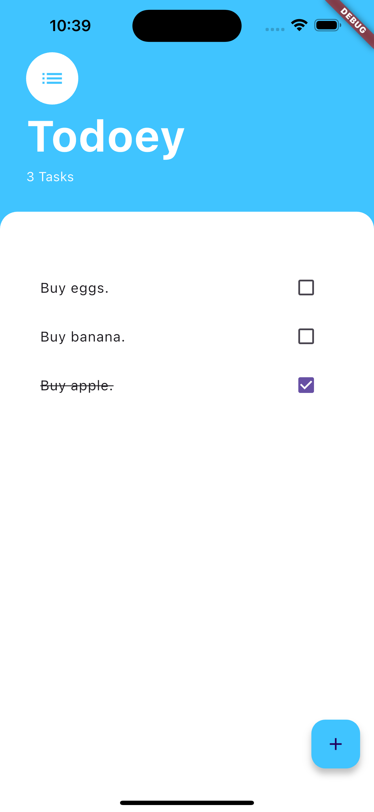
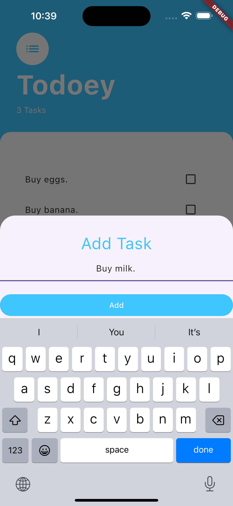

# Todoey Flutter

A simple to-do list app built with Flutter, featuring task management, state management with Provider, and a responsive user interface. 

## Screenshots

<p align="center">
  
  
</p>

## Features
- **Add Tasks**: Enter new tasks using an input form with real-time updates.
- **Mark Tasks Complete**: Tap a checkbox to mark a task as complete or incomplete.
- **Delete Tasks**: Long-press to delete a task from the list.
- **Provider for State Management**: Ensures that tasks update across the app seamlessly.

## Prerequisites

- **Flutter SDK**
- **Provider Package**: For state management

## Installation

1. Clone the repository:
   ```bash
   git clone https://github.com/yourusername/todoey_flutter.git
   ```
2. Navigate to the project directory:
   ```bash
   cd todoey_flutter
   ```
3. Install the required dependencies:
   ```bash
   flutter pub get
   ```

## Usage

1. **Run the App**:
   ```bash
   flutter run
   ```
2. Once the app is running, you can:
   - **Add new tasks** by tapping the "+" icon.
   - **Mark tasks complete** by checking the box next to a task.
   - **Delete tasks** by long-pressing a task.

## Code Overview

- **main.dart**: Initializes the app and sets up `ChangeNotifierProvider` for managing state.
- **Data**: A ChangeNotifier class that manages the task list and provides functions for adding, toggling, and deleting tasks.
- **TasksScreen**: The main screen that displays the list of tasks and provides access to add new tasks.
- **NewTask**: Bottom sheet widget that allows users to add new tasks.
- **TaskTile**: Represents individual tasks with options to mark complete and delete.
- **TasksList**: Displays the full list of tasks using ListView.builder and interacts with `Data` for task actions.

## License

This project is licensed under the MIT License.

